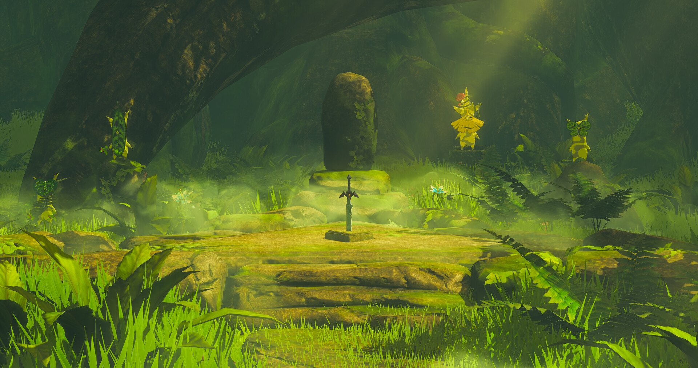
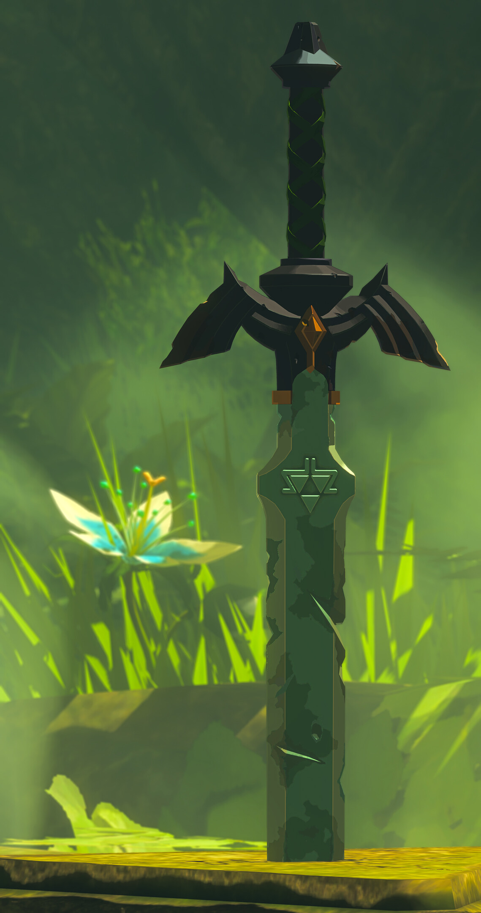
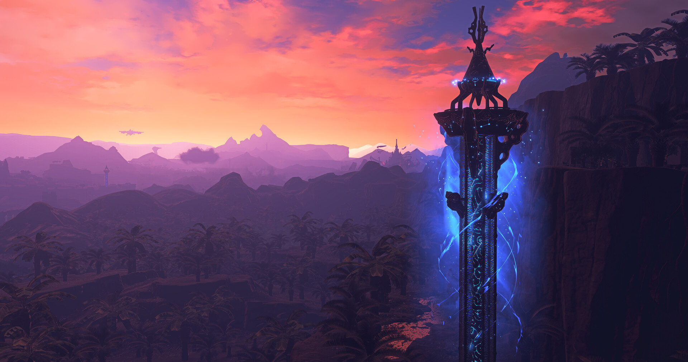

  

<h1 align="center">Hi, I'm Aila ✨</h1>

Backend developer. Python lover. Hyrule fan.

  

---

## 🌿 About Me

- 🎓 Finishing my bachelor's in **Computer Science and Information Systems**.
- 🐍 Mostly a backend developer, my main language is Python.
- 🔧 Currently learning browser automation, tools like Selenium and Camoufox.
- I also work with Django and DRF, some C++, Java (OOP style), a bit of Angular and Unity.
- 🎨 Outside of code, I draw and I love making cosplay props by hand.
- Big Legend of Zelda fan 🗡️ that's part of who I am, not just a theme.
- 💼 Open to small freelance jobs, mostly backend and automation tasks.

 

---

## 🔥 Skills & Tools

#### 💻 Programming Languages & Frameworks

#### 🛠️ Software & Tools

#### 🖥️ IDEs/Editors

---

## 📊 GitHub Stats

  
  &nbsp;&nbsp;
  

  

---

## 🎨 Off Duty

When I'm not coding, I'm usually drawing or building cosplay props from scratch. Foam, paint, way too much hot glue. It's messy, slow, and I love every minute of it. ✂️

 

---

## 💬 Let's Connect

Want to work together or just say hi?

 

  
  &nbsp;
  
  &nbsp;
  

  

