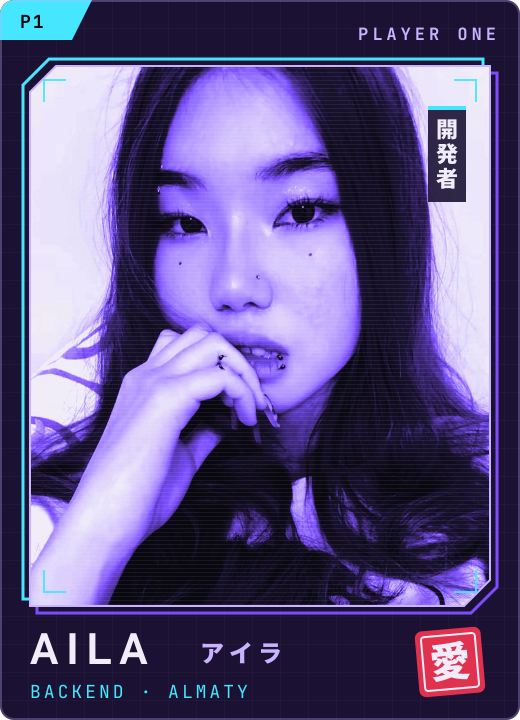
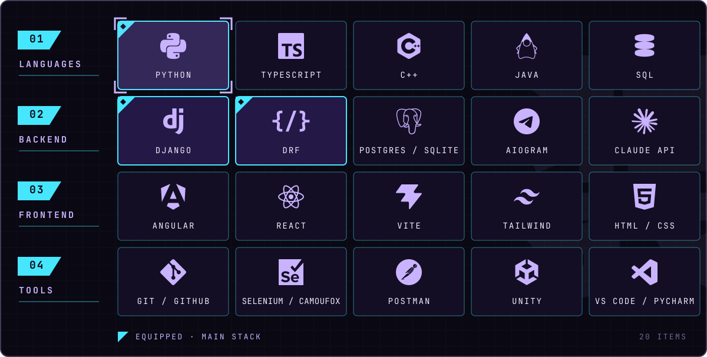
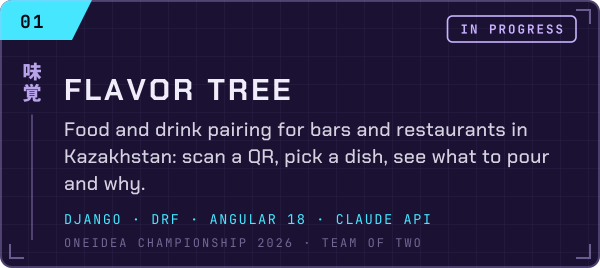
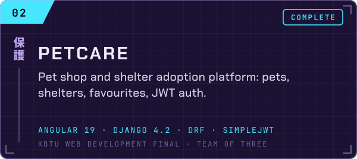
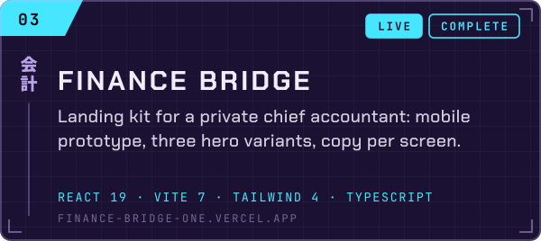
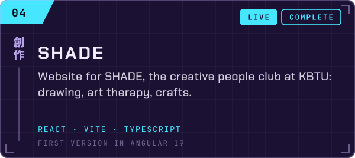
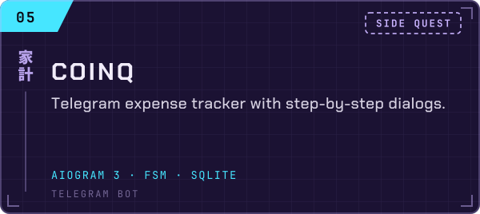
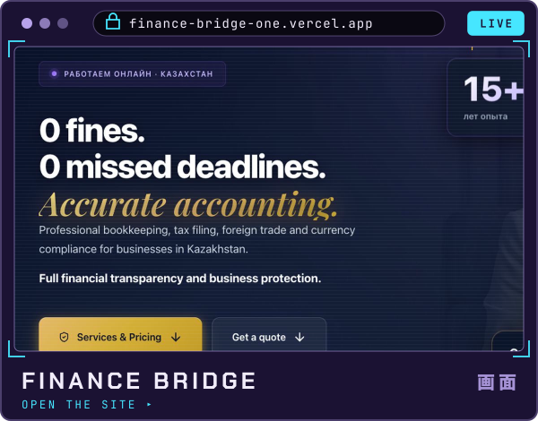
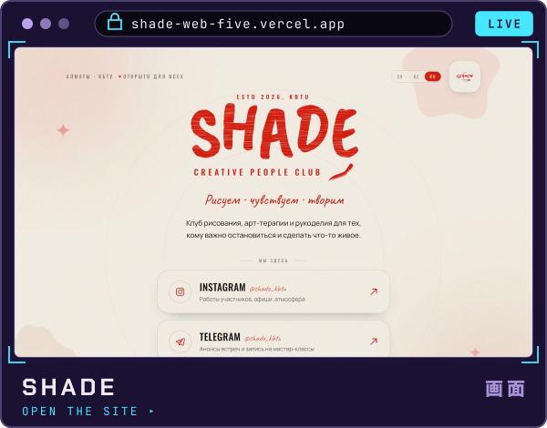
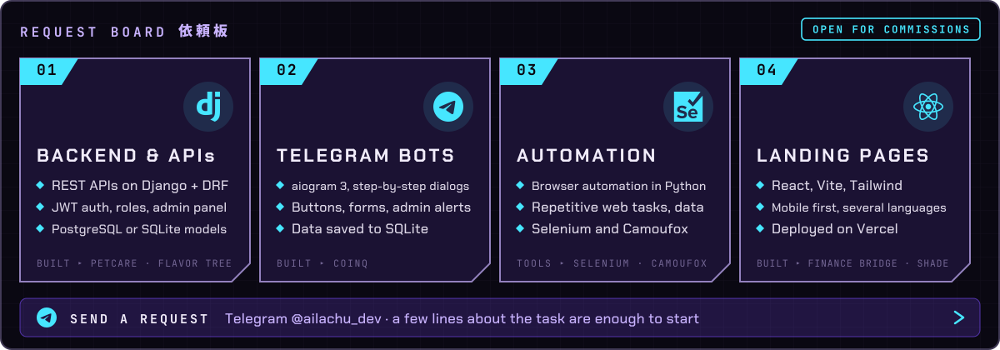

<!-- Panels are built by tools/build.py, this file by tools/readme.py. Texts live in tools/content.py. -->

  <picture><source media="(prefers-color-scheme: dark)" srcset="./assets/hero-dark.svg"><source media="(prefers-color-scheme: light)" srcset="./assets/hero-light.svg"></picture>

  <picture><source media="(prefers-color-scheme: dark)" srcset="./assets/status-dark.svg"><source media="(prefers-color-scheme: light)" srcset="./assets/status-light.svg"></picture>
   
  

  <picture><source media="(prefers-color-scheme: dark)" srcset="./assets/chapter-profile-dark.svg"><source media="(prefers-color-scheme: light)" srcset="./assets/chapter-profile-light.svg"></picture>

<picture><source media="(prefers-color-scheme: dark)" srcset="./assets/portrait-dark.svg"><source media="(prefers-color-scheme: light)" srcset="./assets/portrait-light.svg"></picture>

- Computer Science and Information Systems at KBTU, Almaty.
- Mostly backend, Python first. Django and DRF.
- Browser automation with Selenium and Camoufox, Telegram bots.
- Also TypeScript with Angular and React, some C++, Java (OOP), a bit of Unity.
- I draw, and I build cosplay props by hand.
- Open to small freelance jobs, backend and automation.

 

<b>NOW</b>

- <b>Building</b> · Flavor Tree for OneIdea Championship 2026
- <b>Studying</b> · 3rd year at KBTU
- <b>Learning</b> · browser automation with Selenium and Camoufox
- <b>Based in</b> · Almaty, UTC+5

 

  <picture><source media="(prefers-color-scheme: dark)" srcset="./assets/chapter-arsenal-dark.svg"><source media="(prefers-color-scheme: light)" srcset="./assets/chapter-arsenal-light.svg"></picture>

  <picture><source media="(prefers-color-scheme: dark)" srcset="./assets/arsenal-dark.svg"><source media="(prefers-color-scheme: light)" srcset="./assets/arsenal-light.svg"></picture>

  <picture><source media="(prefers-color-scheme: dark)" srcset="./assets/chapter-quests-dark.svg"><source media="(prefers-color-scheme: light)" srcset="./assets/chapter-quests-light.svg"></picture>

  <a href="https://github.com/Adelllya/Efes-ccl-Flavor"><picture><source media="(prefers-color-scheme: dark)" srcset="./assets/quest-flavor-tree-dark.svg"><source media="(prefers-color-scheme: light)" srcset="./assets/quest-flavor-tree-light.svg"></picture></a>
  <a href="https://github.com/Adelllya/Petcare-Web"><picture><source media="(prefers-color-scheme: dark)" srcset="./assets/quest-petcare-dark.svg"><source media="(prefers-color-scheme: light)" srcset="./assets/quest-petcare-light.svg"></picture></a>

  <a href="https://github.com/Adelllya/Finance_Bridge"><picture><source media="(prefers-color-scheme: dark)" srcset="./assets/quest-finance-bridge-dark.svg"><source media="(prefers-color-scheme: light)" srcset="./assets/quest-finance-bridge-light.svg"></picture></a>
  <a href="https://github.com/Adelllya/shade-web"><picture><source media="(prefers-color-scheme: dark)" srcset="./assets/quest-shade-dark.svg"><source media="(prefers-color-scheme: light)" srcset="./assets/quest-shade-light.svg"></picture></a>

  <picture><source media="(prefers-color-scheme: dark)" srcset="./assets/quest-coinq-dark.svg"><source media="(prefers-color-scheme: light)" srcset="./assets/quest-coinq-light.svg"></picture>
  <picture><source media="(prefers-color-scheme: dark)" srcset="./assets/quest-heart-of-the-hero-dark.svg"><source media="(prefers-color-scheme: light)" srcset="./assets/quest-heart-of-the-hero-light.svg"></picture>

  <a href="https://finance-bridge-one.vercel.app"><picture><source media="(prefers-color-scheme: dark)" srcset="./assets/site-finance-bridge-dark.svg"><source media="(prefers-color-scheme: light)" srcset="./assets/site-finance-bridge-light.svg"></picture></a>
  <a href="https://shade-web-five.vercel.app"><picture><source media="(prefers-color-scheme: dark)" srcset="./assets/site-shade-dark.svg"><source media="(prefers-color-scheme: light)" srcset="./assets/site-shade-light.svg"></picture></a>

  <a href="https://github.com/Adelllya?tab=repositories"><picture><source media="(prefers-color-scheme: dark)" srcset="./assets/archive-dark.svg"><source media="(prefers-color-scheme: light)" srcset="./assets/archive-light.svg"></picture></a>

  <picture><source media="(prefers-color-scheme: dark)" srcset="./assets/chapter-slate-dark.svg"><source media="(prefers-color-scheme: light)" srcset="./assets/chapter-slate-light.svg"></picture>

  <picture><source media="(prefers-color-scheme: dark)" srcset="./assets/slate-dark.svg"><source media="(prefers-color-scheme: light)" srcset="./assets/slate-light.svg"></picture>

  <picture><source media="(prefers-color-scheme: dark)" srcset="./assets/chapter-side-dark.svg"><source media="(prefers-color-scheme: light)" srcset="./assets/chapter-side-light.svg"></picture>

  <picture><source media="(prefers-color-scheme: dark)" srcset="./assets/side-quests-dark.svg"><source media="(prefers-color-scheme: light)" srcset="./assets/side-quests-light.svg"></picture>

  <a href="https://www.tiktok.com/@_ailachuchu_"><picture><source media="(prefers-color-scheme: dark)" srcset="./assets/badge-tiktok-dark.svg"><source media="(prefers-color-scheme: light)" srcset="./assets/badge-tiktok-light.svg"></picture></a>

  <picture><source media="(prefers-color-scheme: dark)" srcset="./assets/chapter-requests-dark.svg"><source media="(prefers-color-scheme: light)" srcset="./assets/chapter-requests-light.svg"></picture>

  <a href="https://t.me/ailachu_dev"><picture><source media="(prefers-color-scheme: dark)" srcset="./assets/requests-dark.svg"><source media="(prefers-color-scheme: light)" srcset="./assets/requests-light.svg"></picture></a>

  <picture><source media="(prefers-color-scheme: dark)" srcset="./assets/chapter-link-dark.svg"><source media="(prefers-color-scheme: light)" srcset="./assets/chapter-link-light.svg"></picture>

  <picture><source media="(prefers-color-scheme: dark)" srcset="./assets/quote-dark.svg"><source media="(prefers-color-scheme: light)" srcset="./assets/quote-light.svg"></picture>

  <a href="https://t.me/ailachu_dev"><picture><source media="(prefers-color-scheme: dark)" srcset="./assets/badge-telegram-dark.svg"><source media="(prefers-color-scheme: light)" srcset="./assets/badge-telegram-light.svg"></picture></a>
  <a href="mailto:ailachu.echo@gmail.com"><picture><source media="(prefers-color-scheme: dark)" srcset="./assets/badge-gmail-dark.svg"><source media="(prefers-color-scheme: light)" srcset="./assets/badge-gmail-light.svg"></picture></a>
  <a href="https://www.tiktok.com/@_ailachuchu_"><picture><source media="(prefers-color-scheme: dark)" srcset="./assets/badge-tiktok-dark.svg"><source media="(prefers-color-scheme: light)" srcset="./assets/badge-tiktok-light.svg"></picture></a>
  <a href="https://pin.it/75PPQTbym"><picture><source media="(prefers-color-scheme: dark)" srcset="./assets/badge-pinterest-dark.svg"><source media="(prefers-color-scheme: light)" srcset="./assets/badge-pinterest-light.svg"></picture></a>

  <picture><source media="(prefers-color-scheme: dark)" srcset="./assets/terminal-dark.svg"><source media="(prefers-color-scheme: light)" srcset="./assets/terminal-light.svg"></picture>

  <picture><source media="(prefers-color-scheme: dark)" srcset="./assets/footer-dark.svg"><source media="(prefers-color-scheme: light)" srcset="./assets/footer-light.svg"></picture>

